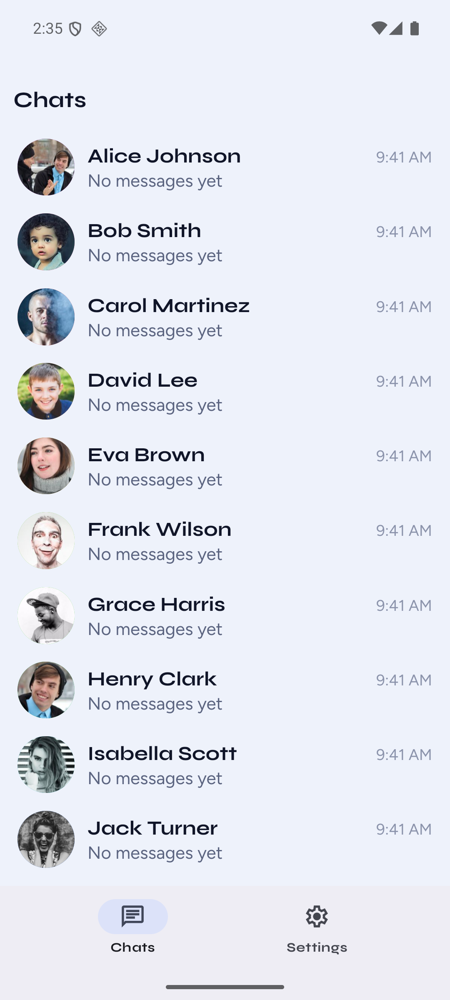
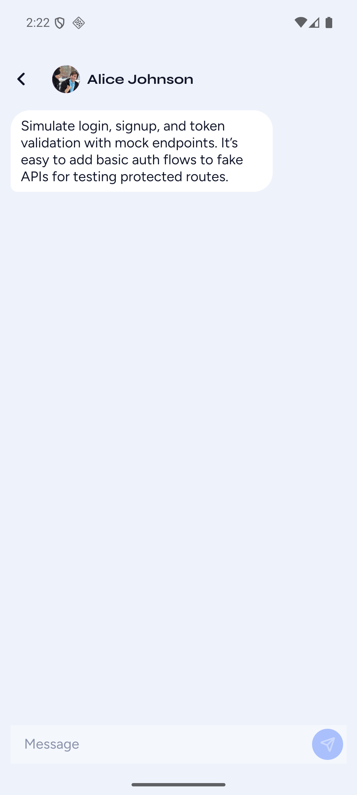
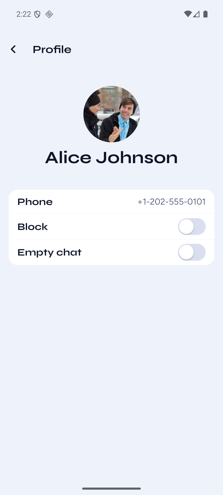
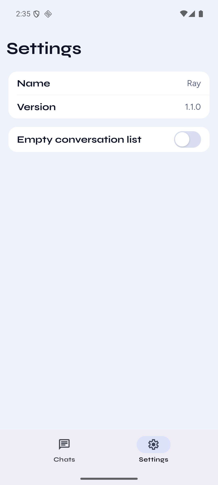

# basic-chat

Expo chat app against `https://responserift.dev/`.

## Demo

<video src="https://github.com/user-attachments/assets/7296d94d-23b6-49d3-8835-c41c98dccabd" controls muted playsinline loop width="360"></video>

## Run

```bash
cp .env.example .env
npm install
npx expo start
```

`EXPO_PUBLIC_API_URL` is already set in [.env.example](.env.example). iOS Simulator or Expo Go. Not Expo web ([docs/agent/verify.md](docs/agent/verify.md)).

Standalone APKs (no Metro). Repo has `basic-chat.apk` (arm64-v8a, phones). Other ABIs live on [GitHub Releases](https://github.com/Ganthology/basic-chat/releases) so the fat build stays off git.

| Asset | Use |
| --- | --- |
| `basic-chat-*-arm64-v8a.apk` | Phones, Apple Silicon emulator |
| `basic-chat-*-armeabi-v7a.apk` | Older 32-bit phones |
| `basic-chat-*-x86_64.apk` | Intel emulator |
| `basic-chat-*-universal.apk` | All of the above |

```bash
npm run android:release
npm run android:release:all
```

`android:release` writes repo-root `basic-chat.apk` (arm64). `android:release:all` also writes versioned files under `dist/apk/`. Needs `android/` (`npx expo prebuild --platform android` if missing).

```bash
npm run storybook
```

On-device Storybook. Swaps the app entry.

Direct deps are exact versions. See [ADR 0003](docs/adr/0003-exact-dependency-versions.md).

## Project structure

```
src/app/                  # Expo Router only
  (tabs)/                 # Chats, Settings
  chat/[id].tsx
  profile/[id].tsx
src/modules/platform/
  style/                  # design tokens
  ui/                     # composable design components + React components
    Avatar/ GroupedTable/ Heading/ Icon/
    IconButton/ ListGroup/ Paragraph/ Toggle/
  logger/                 # sentry
  query/                  # tanstack query
  network/
src/modules/product/
  chat/
  user/
  settings/
```

## Architecture notes

Clean architecture keeps layers independently testable and swappable, so the app stays scalable. AI works on one layer at a time instead of mashing everything into one file. Review stays focused and regressions stay smaller — separation of concerns.

- Thin `src/app` routes → product screens
- Product modules: `chat`, `user`, `settings`. Each is `data → view` (domain unused)
- Platform: composable design components and React components (`style` + `ui`), logger (sentry), query (tanstack query), network
- React Query for server cache. Zustand persist for blocked IDs
- `chat` may import `user` ([ADR 0005](docs/adr/0005-chat-may-import-user.md))

Import rules: [docs/agent/architecture.md](docs/agent/architecture.md).

## Screenshots

Inbox



Chat



Profile



Settings



## How AI was used

I use Cursor agent and Cursor cloud agent to create PRs. I usually have 3–5 agents running in parallel on different tasks/features. I already know the end state I want. They create the PR, I review, then I let the agent merge it.

For the initial UI, I get an agent to prototype different variants and themes so I can decide which to go with, then tweak until I'm satisfied with the layout and look. That part uses the Anthropic frontend-design skill.

Verification is Storybook, Expo Go for quick UI and behaviour checks, and a dev build to test native-required features. I also get agents to run Evan Bacon's [`serve-sim`](https://github.com/evanbacon/serve-sim) so they verify their work before reporting back.

## Docs

- [AGENTS.md](AGENTS.md)
- [docs/agent/architecture.md](docs/agent/architecture.md)
- [docs/adr/README.md](docs/adr/README.md)
