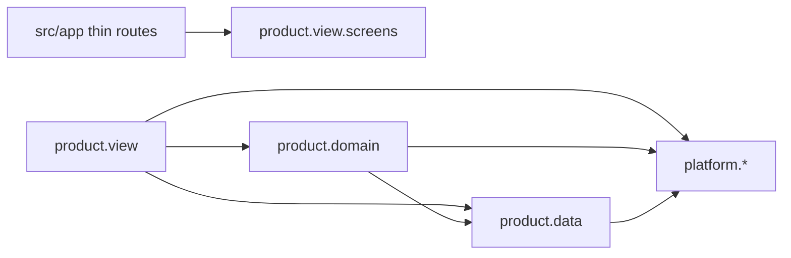

# Architecture

Clean architecture + DDD, interpreted for this repo. Modules colocated by feature. Platform is packages. Product uses `data → domain → view`.



## Layout

```
src/
  app/                          # routes only
  modules/
    platform/                   # packages. No product imports.
      auth/
      storage/
      network/
      query/
      logger/
      style/
      ui/
    product/
      chat/
        data/
          entities/
          services/
          adapters/
          stores/
          repository/
          repositoryImpl/
        domain/
          useCases/
        view/
          screens/
          components/
          viewModel/
          hooks/
          query/
          translations/
      user/
      chat/composer/            # submodule when it owns data + view
```

Imports use `@/modules/...`. Platform is a package mental model, not npm workspaces.

`src/app` is thin route files. Re-export or compose product `view/screens`. No components, hooks, or logic in `app/`. Expo Router kebab-case applies to `src/app` only.

## Import rules

| From | May import | Must not |
| --- | --- | --- |
| `src/app` | product `view/screens` (and layout wiring) | data, domain, other view internals |
| product `view` | own domain, own data, platform, own submodules | other product modules |
| product `domain` | own data (entities, repos), platform, own useCases | view, other product modules |
| product `data` | platform, own entities/services/repos | view, domain, other product |
| platform | other platform (sparingly) | any product |

Exception: `chat` may import `user` (entities, repository contract, repository impl, stores). `user` must not import `chat`. See [ADR 0005](../adr/0005-chat-may-import-user.md).

Shared code goes to platform, or a later shared product module (ADR).

## Platform

Clean code. No `data` / `domain` / `view` split. Treat as imported packages.

Typical packages: `auth`, `storage` (mmkv), `network`, `query` (React Query client, provider, defaults), `logger` (Sentry `Logger` base class), `style` (tokens + `createStyles` + `useLoadFonts`), `ui` (`Heading`, `Paragraph`).

`style` / `ui` name layout roles, not product. `COLOR` is `background`, `container`, `accent` — never `incoming` or other domain nouns. Product maps “their message” → `container`, “mine” → `accent`.

## Product

`data → domain → view`. View may call data or `queryOptions` directly. Domain is glue and reusable useCases, not a mandatory hop.

### data

- `entities` — types and enums only. One export per file. No functions, no React. Domain and view import these. No `domain/entities`.
- `services` — API, local, or any other source. Stay on the wire shape.
- `adapters` — map this module's writes onto a foreign API (e.g. send message → create post).
- `stores` — Zustand vanilla stores. Persist lives here. No React.
- `repository` — contract only.
- `repositoryImpl` — compose services, adapters, and stores. View and domain depend on the contract.

### domain

Pure useCases: same input → same output. No React, no query client, no navigation.

### view

- `screens` — consumed by `src/app`.
- `components` — product-local composition.
- `viewModel` — screen-level orchestration. `hooks` — reusable view logic. Both allowed. Do not invent a state library here.
- `query` — TanStack `queryOptions`. Platform `query` owns the client.
- `translations` — module strings. i18n library is a later decision.

### Submodules

Nest under the product module. Use the same three layers only when the subfeature owns data and view. Otherwise keep it in `view/components`.

## Composable components

Reusable pieces are composable. Parent owns structure via `children`, slots, or render props.

- Platform `style` = tokens + `createStyles`. Platform `ui` composes `Heading` / `Paragraph` from those. Button later.
- Product composes screens from those plus local components.
- No god component that bakes a page layout the parent cannot change.
